# Praktikum Pemrograman Asynchronous
Nama    : Annnisa Tri Amalia
NIM     : 362358302084
Kelas   : 2B TRPL

Praktikum 1: Mengunduh Data dari Web Service (API)
- Mencari judul buku favorit di google books
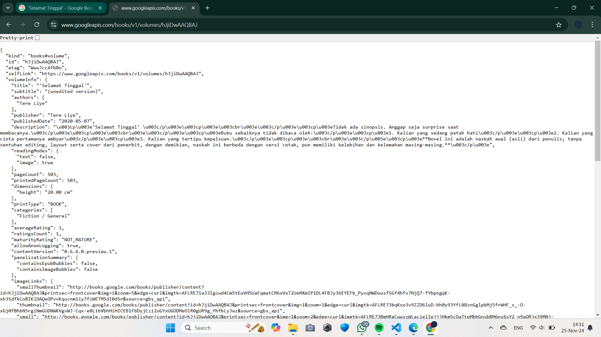

- Menambahkan isi dari praktikum sebelumnya
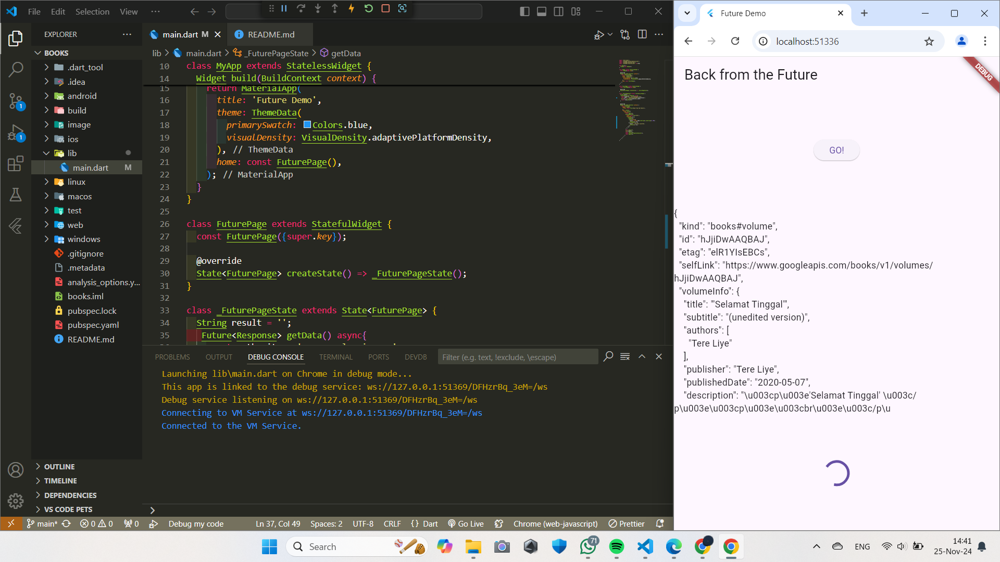
- Substring adalah metode atau fungsi dalam banyak bahasa pemrograman yang digunakan untuk mengambil bagian tertentu dari sebuah string (sub-bagian string). Fungsi ini biasanya menerima parameter awal (index) dan akhir (opsional) untuk menentukan bagian string yang ingin diambil.

- catchError biasanya merujuk pada mekanisme penanganan error (kesalahan) dalam bahasa pemrograman.

Praktikum 2: Menggunakan await/async untuk menghindari callbacks

1. W11: Soal 4
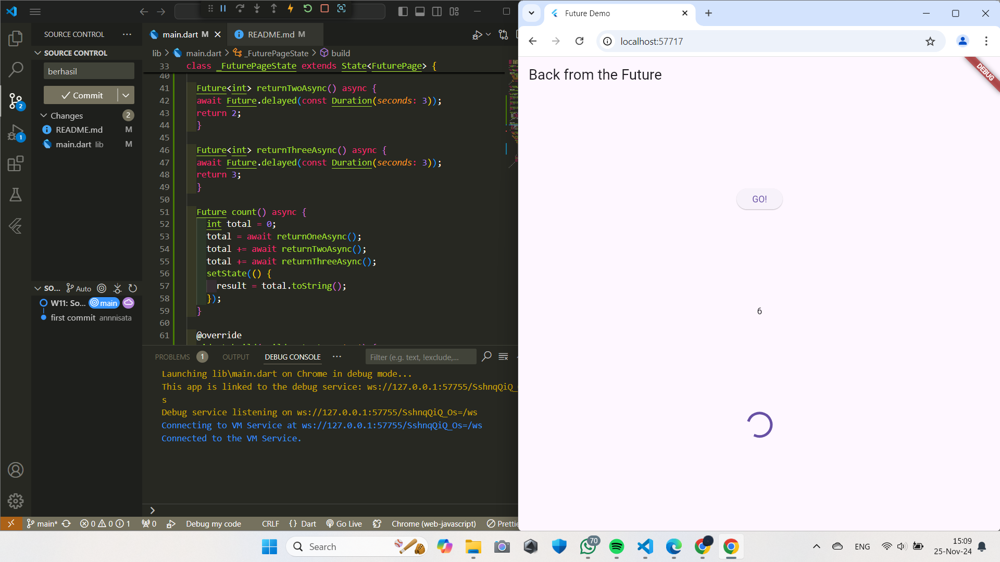

Langkah 1 :
Kode tersebut mensimulasikan operasi yang membutuhkan waktu tertentu dengan penundaan menggunakan Future.delayed. Hal ini berguna dalam mengelola proses asinkron dalam aplikasi.

Langkah 2 : 
Kode tersebut adalah fungsi asinkron dalam bahasa Dart yang menghitung total nilai yang diperoleh dari tiga fungsi returnOneAsync, returnTwoAsync, dan returnThreeAsync. Fungsi ini juga memperbarui tampilan (UI) dengan memanfaatkan setState untuk mengubah nilai variabel result.

Praktikum 3: Menggunakan Completer di Future

W11: Soal 5
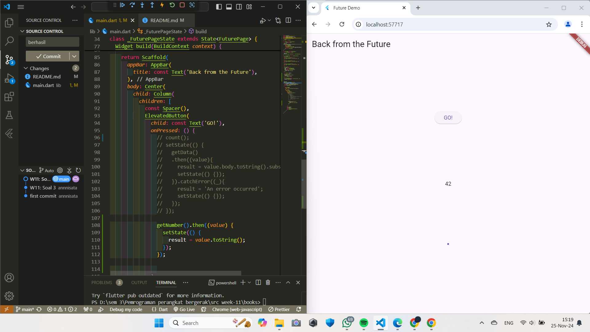

Kode pada langkah 2 bertujuan untuk membuat Future secara manual menggunakan Completer. Menunda hasil dengan menunggu selama 5 detik. Dan menyelesaikan Future dengan nilai 42 menggunakan completer.complete.

W11: Soal 6
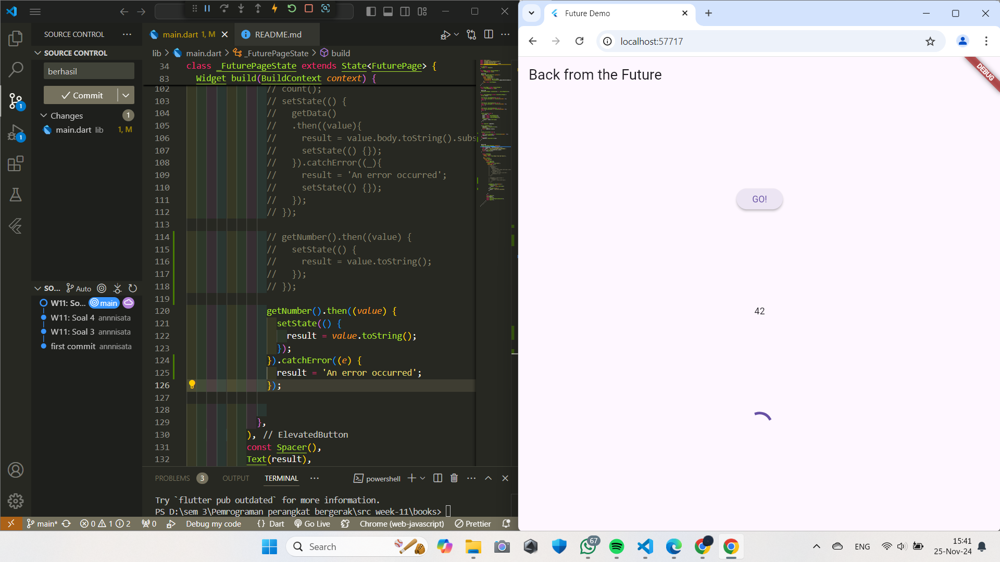

Langkah 5 :
Kode tersebut adalah fungsi asinkron bernama calculate, yang menggunakan blok try-catch untuk menangani kemungkinan kesalahan saat menjalankan operasi asinkron.

Langkah 6 :
Kode tersebut adalah contoh penggunaan Future, yang memanfaatkan metode then dan catchError untuk menangani hasil sukses atau error dari operasi asinkron.

Praktikum 4: Memanggil Future secara paralel

Langkah 1-3
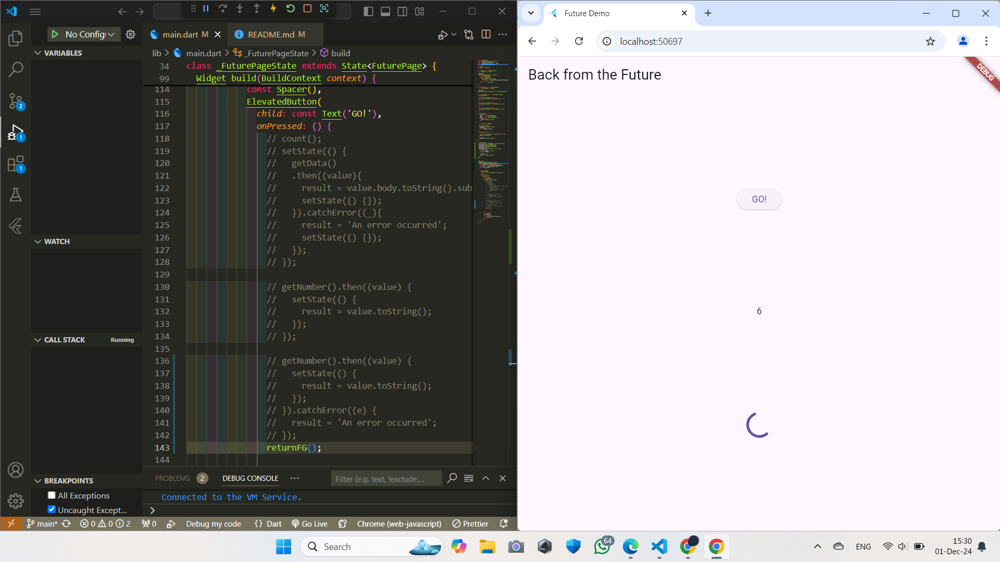

Soal 8
Future.wait() sangat berguna untuk meningkatkan kinerja dan efisiensi ketika menjalankan beberapa operasi asinkron secara paralel

Praktikum 5: Menangani Respon Error pada Async Code

Langkah 1-3
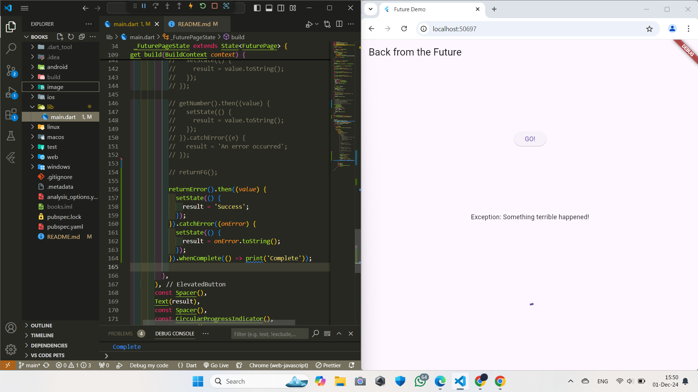

Langkah 4 handleError
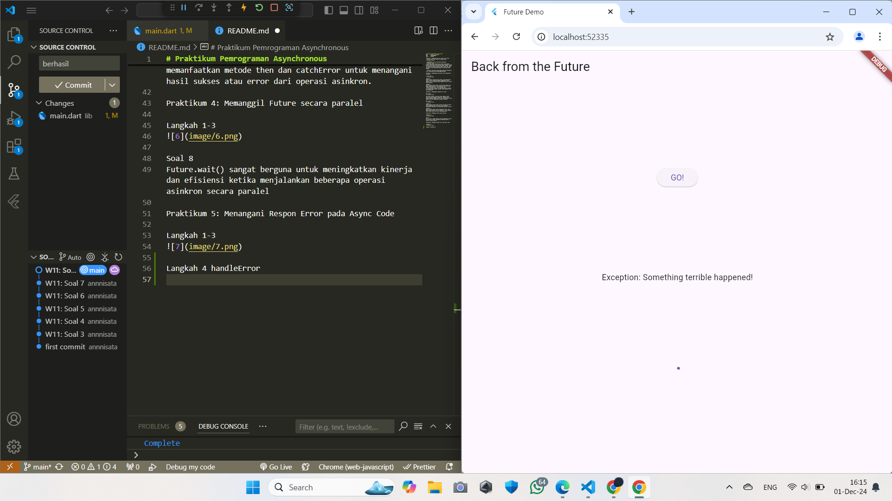

Soal 10
Dengan menambahkan fungsi handleError(), kita telah membuat aplikasi menjadi lebih robust dan dapat menangani error dengan baik.

Praktikum 6: Menggunakan Future dengan StatefulWidget

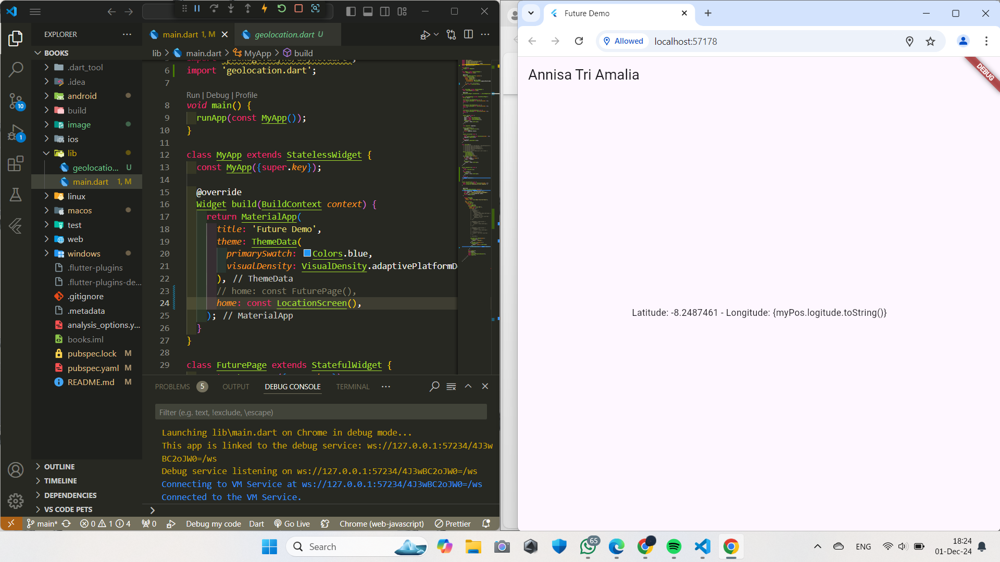

Apakah Anda mendapatkan koordinat GPS ketika run di browser? Mengapa demikian?

Jawab : Flutter di browser tidak bisa mendapatkan koordinat GPS dengan geolocator karena keterbatasan browser terhadap API native.

Praktikum 7: Manajemen Future dengan FutureBuilder

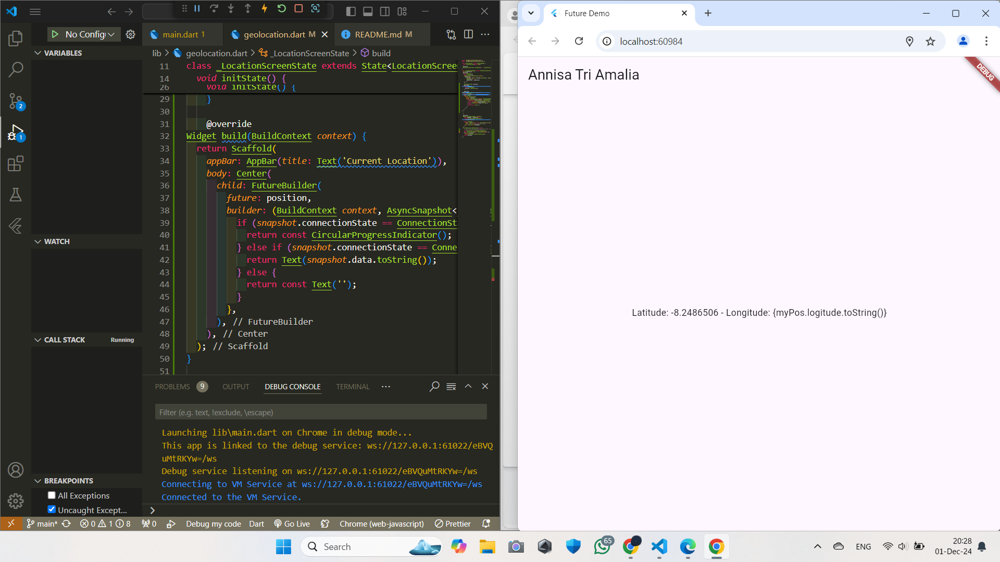

W11: Soal 13
Soal 13
Apakah ada perbedaan UI dengan praktikum sebelumnya? Mengapa demikian?

Jawab : 
Langkah 1: Modifikasi method getPosition dengan membuka file geolocation
Langkah 2: Menambahkan variabel di class _LocationScreenState
Langkah 3: Menambahkan method di build ()

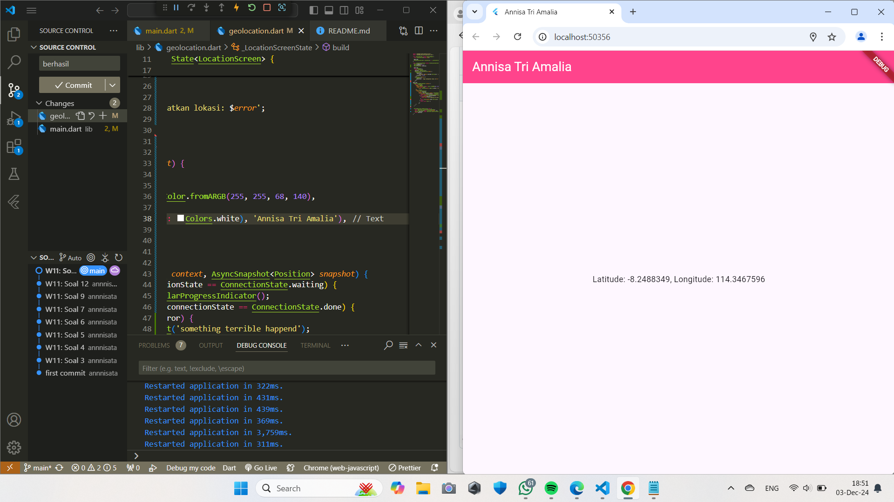
W11: Soal 14
Apakah ada perbedaan UI dengan langkah sebelumnya? Mengapa demikian?
jawab : Menambahkan heandling error dan hasilnya akan terlihat seperti digambar